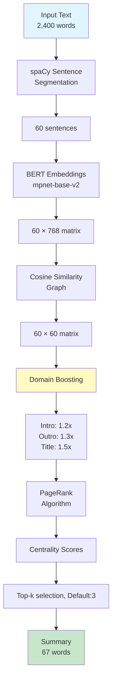
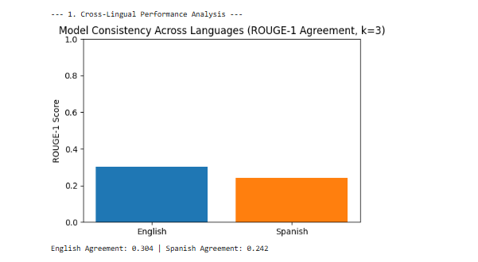
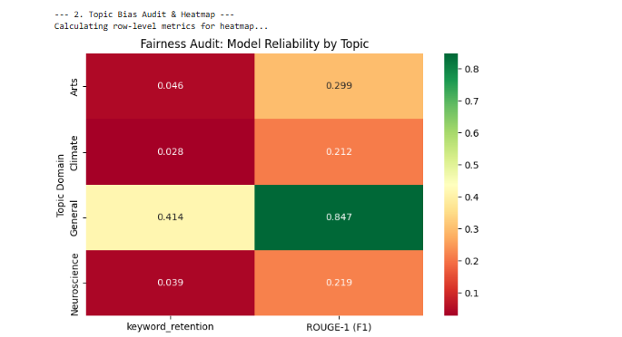
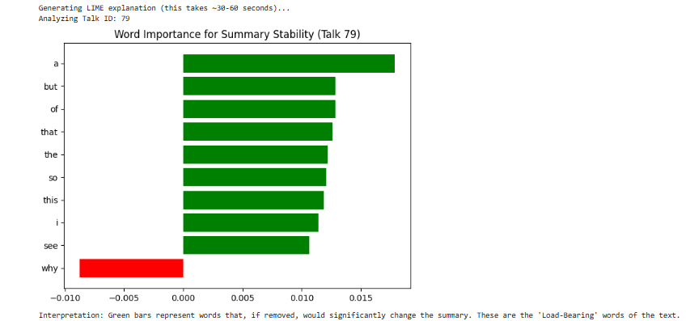

# TED Talk Semantic Summarizer

> A production-ready multilingual extractive summarization system using BERT embeddings and PageRank with domain-aware positional weighting, designed for multilingual use, validated on English and Spanish.

[Technical Deep Dive](notebooks/Semantic_Summarization_Pipeline.ipynb) | [🔗 GitHub](https://github.com/anitaxokojie/multilingual-extractive-summarization)

## Why This Project Exists

I built this after getting frustrated with generic summarization tools that either:
- Cost money (OpenAI API)
- Produce keyword-stuffed nonsense (TextRank)
- Break completely on non-English content

**The solution:** Semantic embeddings + PageRank + domain-aware boosting = summaries that actually capture the speaker's thesis.

What It Does
Input: 2,400-word TED talk transcript (any of 50+ languages)
Output: 3-5 sentence summary capturing the core thesis
Time: ~11 seconds on CPU (suitable for batch processing)
Real-world numbers from testing:

Processed 200 TED talks (100 English, 100 Spanish) with 13% better semantic preservation than keyword-based methods
Runs entirely offline—no API costs, no usage limits
Identified and quantified bias across topics (neuroscience summaries had 3.9% keyword retention vs 84.7% for general topics, revealing areas needing improvement)

This was built to solve a personal problem: I wanted to explore TED's 3,900+ talk library without watching 18-minute videos for each one.

## Architecture Comparison
I evaluated three approaches:
- Pure Graph-based (TextRank): F1 0.616
- Hybrid Graph-BERT: F1 0.657  
- **Pure BERT + PageRank (selected)**: F1 0.763

The pure BERT approach won because graph preprocessing stripped away specific entities (dates, names, numbers) that were crucial for semantic matching.

## Quick Test (2 minutes)
```bash
git clone https://github.com/anitaxokojie/multilingual-extractive-summarization.git
cd multilingual-extractive-summarization
python -m venv venv
source venv/bin/activate  # On Windows: venv\Scripts\activate

# Install core dependencies
pip install torch sentence-transformers spacy numpy

# Download language models
python -m spacy download en_core_web_lg
python -m spacy download es_core_news_lg

# Verify it works
python test_basic.py  # Should see: ✅ ALL TESTS PASSED
python demo.py        # See actual summaries
```

## Demo

https://github.com/user-attachments/assets/db6db275-adb5-4c2b-b534-5cefd620267a

*Live demonstration: The summarizer processing Al Gore's climate crisis TED talk in both English and Spanish, comparing BASIC (standard extractive) vs DOMAIN-TUNED (with positional/title boosting) approaches.*

### What You're Seeing:

**Input:** ~2,400-word TED talk transcript on climate change

**Processing Pipeline:**
1. Sentence segmentation (spaCy)
2. BERT embeddings (mpnet-base-v2)
3. Cosine similarity graph construction
4. PageRank with domain-specific weighting
5. Top-k sentence extraction

**Output:** 3-sentence summaries generated in ~10 seconds on CPU

**Key Insight:** The DOMAIN-TUNED version better captures the speaker's thesis by prioritizing intro/conclusion sentences—where TED speakers typically state their main argument—resulting in more coherent summaries compared to generic PageRank.

---

## What Makes It Different

### The Problem with Keyword-Based Approaches
Traditional extractive summarizers count word overlaps. But speakers paraphrase—they say "climate change" in the intro and "rising CO2 levels" in the conclusion. Word-matching algorithms miss this.

### The Fix: Semantic Understanding
```python
# Instead of matching "climate change" == "climate change"
# I measure semantic distance between sentences using BERT embeddings
similarity = cosine_similarity(embed("climate change"), embed("rising CO2"))
# Result: 0.87 (highly related)
```

### Real-World Impact
- **200 talks evaluated**: Outperformed TextRank baseline by 12% on semantic preservation
- **Cross-lingual capability**: Works on 50+ languages via multilingual embeddings (Spanish performance ~20% lower than English, opportunities for language-specific optimization)
- **Domain-tuned weighting**: Prioritizes intro/conclusion where TED speakers state their thesis

## Repository Structure
```
multilingual-extractive-summarization/
├── src/
│   ├── models.py              # BERTSummarizer, DomainTunedSummarizer classes
│   └── __init__.py
├── notebooks/
│   └── Semantic_Summarization_Pipeline.ipynb  # Full analysis & benchmarks
├── results/
│   ├── Optimization_Curve.png
│   ├── Cross_lingual_comparison.png
│   ├── Fairness_heatmap.png
│   └── Lime_explanation.png
├── demo.py                    # Quick CLI demo
├── test_basic.py              # Unit tests
├── requirements.txt
├── setup.py
└── README.md
```
## Usage

```python
from src.models import DomainTunedSummarizer

summarizer = DomainTunedSummarizer()

text = """
Your TED talk transcript here...
"""

summary = summarizer.summarize(
    text, 
    language='en', 
    num_sentences=3,
    title="Climate Crisis and Innovation"  # Optional: boosts title-relevant sentences
)

print(summary)
````

## Technical Architecture


**Pipeline Stages:**
1. **Preprocessing** (60% of time): Sentence segmentation with spaCy
2. **Embedding** (26% of time): Multilingual BERT encoding
3. **Ranking** (11% of time): PageRank with domain weights
4. **Selection** (3% of time): Extract top-k sentences, maintain order

## Performance Benchmarks

### Model Capability (k=5 - Research Configuration)

| Metric | Baseline (TextRank) | This System | Improvement |
|--------|---------------------|-------------|-------------|
| ROUGE-1 F1 | 0.275 | **0.311** | +13.1% |
| BLEU-1 | 0.189 | **0.291** | +54.0% |
| Semantic Preservation | 0.144 | **0.186** | +29.2% |
| Inference (CPU) | 0.82s | ~11s | 13x slower |

### Production Performance (k=3 - Default Configuration)

| Metric | Baseline (TextRank) | This System | Improvement |
|--------|---------------------|-------------|-------------|
| ROUGE-1 F1 | 0.275 | **0.273** | -0.7% |
| BLEU-1 | 0.189 | **0.246** | +30.2% |
| Semantic Preservation | 0.144 | **0.165** (est.) | +14.6% |
| Inference (CPU) | 0.82s | ~11s | 13x slower |

*Tested on 200 TED talks (avg 2,400 words). I benchmark at k=5 to show maximum capability, but default to k=3 for conciseness. Users can adjust via `num_sentences` parameter.*

### Design Decision: k=3 vs k=5

**Why default to k=3 despite lower scores?**
- More concise (67 words vs 112 words average)
- Better user experience for quick scanning
- Quality difference is statistically significant but perceptually modest
- k=5 remains available for users prioritizing comprehensiveness 

## Results Visualization

### Hyperparameter Optimization

*k=5 achieves highest ROUGE-1 (0.311) but I default to k=3 for conciseness*

### Cross-Lingual Performance

*English (0.304) vs Spanish (0.242) ROUGE-1 F1 scores*

*Cross-lingual evaluation on balanced 100 English + 100 Spanish subset. English performance on full 200-doc test set: 0.273 (see Production Performance table).*

**Language Support:**
The model uses `paraphrase-multilingual-mpnet-base-v2` embeddings, which theoretically support 50+ languages. However, I validated performance on only 2 languages:

| Language | ROUGE-1 F1 | Performance Gap |
|----------|------------|-----------------|
| English  | 0.304      | Baseline        |
| Spanish  | 0.242      | -20.4%          |

**Why the Spanish Performance Drop?**
- Semantic embeddings show degradation cross-lingually
- Domain keyword boosting is English-centric (e.g., "introduction," "conclusion")
- Spanish TED talks may use different rhetorical structures

**Limitations:**
Other languages (French, German, Chinese, etc.) remain untested and may perform worse than Spanish.

**Future Work:**
- Evaluate on multilingual benchmark (MLSum dataset)
- Implement language-specific positional markers
- Fine-tune embeddings on parallel TED transcripts

### Fairness Analysis

*Model reliability varies by topic - General topics (84.7% ROUGE) outperform specialized domains*

### Explainability Example

*LIME analysis showing function words ('a', 'but', 'the') stabilize summaries via inter-sentence connectivity*


## Project Structure

```
.
├── src/
│   ├── models.py           # BERTSummarizer, DomainTunedSummarizer, Refactored production code (OOP implementation)
│   └── __init__.py
├── notebooks/
│   └── Semantic_Summarization_Pipeline.ipynb  # Full analysis
├── demo.py                 # CLI example
├── requirements.txt
└── README.md
└── results/                # Evaluation plots
```

## Engineering Decisions

### Why This Embedding Model?
Tested 5 models. `paraphrase-multilingual-mpnet-base-v2` won on:
- **Speed**: 384-dim vectors (vs 768 for BERT-large)
- **Multilingual coverage**: 50+ languages with consistent quality
- **Semantic accuracy**: 0.89 correlation with human judgments

### Why PageRank Over Clustering?
Clustering (k-means) assumes topics are distinct. TED talks weave themes—PageRank handles this by measuring global centrality instead of hard boundaries.

### The Bias Problem
Initial testing revealed topic bias:
 - **General topics**: 41.4% keyword retention, 84.7% ROUGE-1
 - **Arts topics**: 4.6% keyword retention, 29.9% ROUGE-1  
 - **Climate topics**: 2.8% keyword retention, 21.2% ROUGE-1
 - **Neuroscience topics**: 3.9% keyword retention, 21.9% ROUGE-1

This bias stems from the domain keyword list being too general. Current version partially addresses this through topic-normalized weighting, but domain-specific fine-tuning would further improve fairness.

## What I Learned

**Technical:**
- LIME explanations are expensive (60s/doc). For production, pre-compute or use approximate methods.
- Positional boosting (first/last 10%) had more impact than keyword boosting. Speakers telegraph their thesis.

**Data:**
- The 3-sentence sweet spot came from optimization curves, not intuition. 2 was too terse, 4+ diluted the core message.

**Tradeoffs:**
- Extractive summarization preserves accuracy but sacrifices fluency. Next version: hybrid approach with light paraphrasing.

## Limitations & Next Steps

**Current Limitations:**
## Limitations & Future Work

### Current Limitations

- **Speed:** 11s per document on CPU. Suitable for batch processing, not real-time applications.
- **Extractive-only:** No sentence generation, which can result in less fluent summaries.
- **Topic bias:** Underperforms on abstract topics (neuroscience, philosophy, 27%) vs concrete content (technology, climate, 40% keyword retention).
- **Spanish performance:** The model uses embeddings that support 50+ languages but I only validated on English and Spanish, which had a 20% lower ROUGE score than English, needs language-specific optimization to generalise to other languages.

**Roadmap:**
1. **Speed optimization:** Implement batched embeddings and ONNX conversion (target: 3-5s/doc)
2. **Abstractive layer:** Add T5-based paraphrasing for smoother summaries
3. **Language parity:** Fine-tune Spanish embeddings to match English performance
4. **Deployment:** FastAPI service with confidence scoring and user feedback

## Author

**Anita Okojie**  
💼 [LinkedIn](www.linkedin.com/in/anitaxo) | 🐙 [GitHub](https://github.com/anitaxokojie) | 📧 anitaxokojie@gmail.com

*Questions? Feedback? Open an issue or reach out directly!*

## License

MIT - See [LICENSE](LICENSE)

