# TED Talk Semantic Summarizer

> A production-ready multilingual extractive summarization system that uses transformer embeddings and graph algorithms to generate concise summaries of TED talks in 50+ languages.

[Technical Deep Dive](notebooks/Semantic_Summarization_Pipeline.ipynb) | [🔗 GitHub](https://github.com/anitaxokojie/multilingual-extractive-summarization)

## Why This Project Exists

I built this after getting frustrated with generic summarization tools that either:
- Cost money (OpenAI API)
- Produce keyword-stuffed nonsense (TextRank)
- Break completely on non-English content

**The solution:** Semantic embeddings + PageRank + domain-aware boosting = summaries that actually capture the speaker's thesis.

## Quick Test (2 minutes)
```bash
git clone https://github.com/anitaxokojie/multilingual-extractive-summarization.git
cd multilingual-extractive-summarization
python -m venv venv
source venv/bin/activate  # On Windows: venv\Scripts\activate

# Install core dependencies
pip install torch sentence-transformers spacy numpy

# Download language models
python -m spacy download en_core_web_lg
python -m spacy download es_core_news_lg

# Verify it works
python test_basic.py  # Should see: ✅ ALL TESTS PASSED
python demo.py        # See actual summaries
```
## What Makes It Different

### The Problem with Keyword-Based Approaches
Traditional extractive summarizers count word overlaps. But speakers paraphrase—they say "climate change" in the intro and "rising CO2 levels" in the conclusion. Word-matching algorithms miss this.

### The Fix: Semantic Understanding
```python
# Instead of matching "climate change" == "climate change"
# We measure semantic distance between sentences using BERT embeddings
similarity = cosine_similarity(embed("climate change"), embed("rising CO2"))
# Result: 0.87 (highly related)
```

### Real-World Impact
- **200 talks evaluated**: Outperformed TextRank baseline by 12% on semantic preservation
- **Cross-lingual capability**: Works on 50+ languages via multilingual embeddings (Spanish performance ~20% lower than English, opportunities for language-specific optimization)
- **Domain-tuned weighting**: Prioritizes intro/conclusion where TED speakers state their thesis

## Quick Start

```bash
# Clone and install
git clone https://github.com/anitaxokojie/multilingual-extractive-summarization.git
cd multilingual-extractive-summarization
pip install -r requirements.txt
python -m spacy download en_core_web_lg es_core_news_lg

# Run inference
python demo.py
```

## Usage

```python
from src.models import DomainTunedSummarizer

summarizer = DomainTunedSummarizer()

text = """
Your TED talk transcript here...
"""

summary = summarizer.summarize(
    text, 
    language='en', 
    num_sentences=3,
    title="Climate Crisis and Innovation"  # Optional: boosts title-relevant sentences
)

print(summary)
```

## Technical Architecture

```
Input Text
    ↓
Sentence Segmentation (spaCy)
    ↓
Multilingual Embeddings (mpnet-base-v2)
    ↓
Semantic Similarity Graph
    ↓
Domain-Aware PageRank
    ├─ Intro/outro boosting (1.2x/1.3x)
    ├─ Title alignment (1.5x)
    └─ Keyword presence (1.4x)
    ↓
Top-K Sentence Extraction
```

## Performance Benchmarks

| Metric | Baseline (TextRank) | This System | Improvement |
|--------|---------------------|-------------|-------------|
| ROUGE-1 F1 | 0.275 | 0.308 | +12.0% |
| Semantic Preservation | 0.144 | 0.186 | +29.2% |
| Cross-lingual Parity | N/A | -20% | - |
| Inference (CPU, per talk) | 0.82s | 11s | Trade-off for quality |

*Tested on 200 TED talks (avg 2,400 words). Slower than keyword methods but significantly more accurate. Suitable for batch processing, research pipelines, and offline analysis—not real-time applications.*

## Project Structure

```
.
├── src/
│   ├── models.py           # BERTSummarizer, DomainTunedSummarizer
│   └── __init__.py
├── notebooks/
│   └── Semantic_Summarization_Pipeline.ipynb  # Full analysis
├── demo.py                 # CLI example
├── requirements.txt
└── README.md
```

## Engineering Decisions

### Why This Embedding Model?
Tested 5 models. `paraphrase-multilingual-mpnet-base-v2` won on:
- **Speed**: 384-dim vectors (vs 768 for BERT-large)
- **Multilingual coverage**: 50+ languages with consistent quality
- **Semantic accuracy**: 0.89 correlation with human judgments

### Why PageRank Over Clustering?
Clustering (k-means) assumes topics are distinct. TED talks weave themes—PageRank handles this by measuring global centrality instead of hard boundaries.

### The Bias Problem
Initial testing revealed topic bias:
- **General topics**: 84.7% keyword retention, strong performance
- **Neuroscience topics**: 3.9% keyword retention (severely underperformed)
- **Arts/Climate topics**: Moderate performance (~21-30% retention)

This bias stems from the domain keyword list being too general. Current version partially addresses this through topic-normalized weighting, but domain-specific fine-tuning would further improve fairness.

## What I Learned

**Technical:**
- LIME explanations are expensive (60s/doc). For production, pre-compute or use approximate methods.
- Positional boosting (first/last 10%) had more impact than keyword boosting. Speakers telegraph their thesis.

**Data:**
- The 3-sentence sweet spot came from optimization curves, not intuition. 2 was too terse, 4+ diluted the core message.

**Tradeoffs:**
- Extractive summarization preserves accuracy but sacrifices fluency. Next version: hybrid approach with light paraphrasing.

## Limitations & Next Steps

**Current Limitations:**
- **Speed:** 11s per document on CPU. Suitable for batch processing, not real-time applications.
- **Extractive-only:** No sentence generation, which can result in less fluent summaries.
- **Topic bias:** Underperforms on abstract topics (neuroscience, philosophy) vs concrete content (technology, climate).
- **Spanish performance:** 20% lower ROUGE scores than English, needs language-specific optimization.

**Roadmap:**
1. **Speed optimization:** Implement batched embeddings and ONNX conversion (target: 3-5s/doc)
2. **Abstractive layer:** Add T5-based paraphrasing for smoother summaries
3. **Language parity:** Fine-tune Spanish embeddings to match English performance
4. **Deployment:** FastAPI service with confidence scoring and user feedback

## License

MIT - See [LICENSE](LICENSE)

## Contact

Built by Anita Okojie

*This project was developed to solve a real problem: making TED's 3,900+ talk library navigable without spending hours watching 18-minute videos.*


## Technical Architecture


```mermaid
graph TD
    A[Input Text<br/>2,400 words] --> B[spaCy Sentence<br/>Segmentation]
    B --> C[60 sentences]
    C --> D[BERT Embeddings<br/>mpnet-base-v2]
    D --> E[60 × 768 matrix]
    E --> F[Cosine Similarity<br/>Graph]
    F --> G[60 × 60 matrix]
    G --> H[Domain Boosting]
    H --> I[Intro: 1.2x<br/>Outro: 1.3x<br/>Title: 1.5x]
    I --> J[PageRank<br/>Algorithm]
    J --> K[Centrality Scores]
    K --> L[Top-5 Selection]
    L --> M[Summary<br/>67 words]
    
    style A fill:#e1f5ff
    style M fill:#c8e6c9
    style H fill:#fff9c4
```

**Pipeline Stages:**
1. **Preprocessing** (60% of time): Sentence segmentation with spaCy
2. **Embedding** (26% of time): Multilingual BERT encoding
3. **Ranking** (11% of time): PageRank with domain weights
4. **Selection** (3% of time): Extract top-k sentences, maintain order
