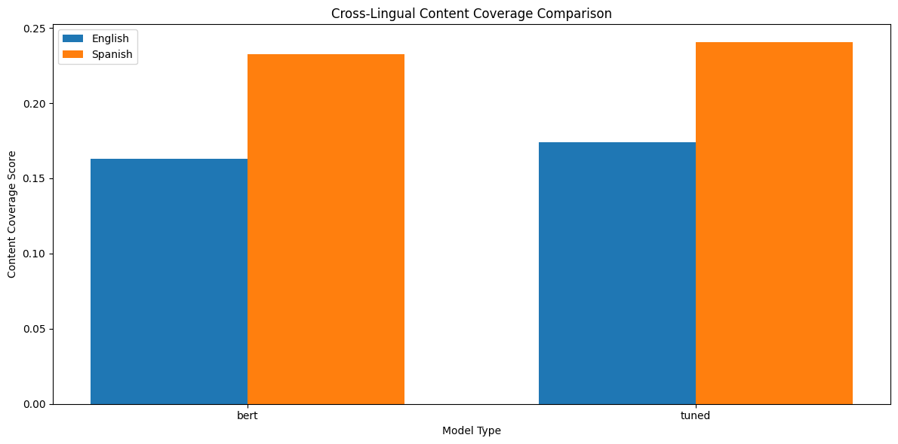

# Visualization Gallery

This directory contains visualizations demonstrating the performance and analysis of our multilingual extractive summarization system. These visualizations provide empirical evidence of the model's capabilities and insights into its behavior across languages and configurations.

## Data Exploration

### Word Frequency Analysis

*Visualization of most common words in the TED Talk corpus, combining both English and Spanish transcripts. Note the prominence of both English ("people", "know", "think") and Spanish ("persona", "año", "pensar") terms.*

### Sentence Length Distribution

*Distribution of sentence lengths in TED Talk transcripts across English and Spanish, showing concentration around certain word counts.*

## Model Performance Visualizations

### Summarization Model Comparison

*Comparison of ROUGE and BLEU scores across different summarization models: Baseline (PyTextRank), Basic BERT, Domain-Tuned, and Optimized versions.*

### Detailed Metrics Comparison

*Detailed comparison of multiple evaluation metrics between Basic BERT and Domain-Tuned models, including ROUGE, BLEU, and content coverage scores.*

### Final Model Comparison

*Comparison of content coverage between English and Spanish models, showing consistently higher coverage in Spanish models.*

## Cross-Lingual Analysis

### ROUGE Score Comparison

*Cross-lingual performance comparison showing ROUGE-1 F1 scores between English and Spanish models, with Spanish showing +1.6-1.7% better performance.*

### BLEU Score Comparison

*Cross-lingual comparison of BLEU-1 scores between English and Spanish models, showing varying patterns between Basic BERT and Domain-Tuned models.*

### Content Coverage Analysis

*Analysis of content coverage across languages, demonstrating Spanish models' superior performance in maintaining key information.*

## Fairness Assessment

### Topic Fairness Bar Chart

*Assessment of model performance across different topic categories, showing significant variation in both length ratio and keyword preservation.*

### Fairness Metrics Heatmap

*Heatmap visualization of fairness metrics across topic categories, highlighting biases toward technical content.*

## Explainability Visualizations

### Sentence Importance (Basic Model)

*LIME-based visualization of sentence importance factors in the Basic BERT model's summarization process.*

### Sentence Importance (Tuned Model)

*LIME-based visualization of sentence importance factors in the Domain-Tuned model's summarization process.*

### Feature Importance Comparison

*Comparison of feature importance between Basic BERT and Domain-Tuned models, showing how domain tuning affects sentence selection criteria.*

### Contrastive Analysis

*Comparison between selected and excluded sentences with explanation of selection criteria, showing semantic similarity between contrasting pairs.*

## Optimization Results

### Sentence Count Optimization

*Analysis of ROUGE-1 F1, BLEU-1, and runtime across different summary lengths (2-5 sentences), showing optimal performance at 5 sentences.*
